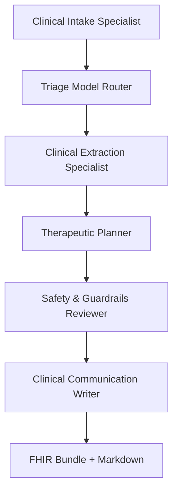

# IBS Digital Therapeutic Orchestrator Case Study

This walkthrough documents a realistic use of the digital-therapeutic orchestrator for a working professional with irritable bowel syndrome (IBS). It covers the clinical scenario, how to configure CrewAI and OpenMed, the hierarchical workflow that runs end to end, and the outputs that can be handed off to care teams.

## Scenario: Alicia M., Marketing Director

- **Profile:** 35-year-old marketing director who travels frequently for client launches.
- **Primary concerns:** Six months of cramping, bloating, and urgent loose stools that flare during travel weeks. Baseline reflux is managed with daily omeprazole; she recently added peppermint oil capsules.
- **Context:** Low-FODMAP diet adherence is inconsistent while travelling. She reports poor sleep, fatigue, and generalized anxiety when major campaigns are underway.
- **Therapeutic goal:** Rapidly adapt relaxation-based IBS protocols to balance symptom control and demanding work cycles while checking for reflux/peppermint interactions.

These details mirror the intake brief we provide to the orchestrator via the `--text` argument.

## Environment preparation

1. Install the extended dependencies (CrewAI, OpenMed, PyTorch CPU build, and supporting libraries):

   ```bash
   pip install crewai openmed pydantic==2.* rich python-dotenv transformers \
     torch --index-url https://download.pytorch.org/whl/cpu
   ```

2. Supply an LLM provider key for both the manager and subordinate agents. The orchestrator now reads the agent model name from `ORCHESTRATOR_AGENT_LLM` (defaults to `gpt-4o-mini`). For OpenAI-backed runs:

   ```bash
   export OPENAI_API_KEY="sk-..."
   export ORCHESTRATOR_AGENT_LLM="gpt-4o-mini"
   ```

3. (Optional) If running in a restricted environment without outbound Hugging Face access, set `OPENMED_OFFLINE=1` to fall back to the curated synthetic OpenMed outputs bundled with the repository. Omit this variable to pull live checkpoints.

## Hierarchical workflow execution

Run the full IBS orchestration flow from the repository root. The first execution pulls ~2 GB of OpenMed checkpoints, so allow a few minutes for the downloads to populate the local Hugging Face cache:

```bash
python -m src.orchestrator.cli \
  --manager-llm gpt-4o \
  --text "35-year-old marketing manager with IBS since college. Past six months sees 4-5 days/week of lower abdominal cramping, bloating, and urgent loose stools triggered by client travel. Following low-FODMAP plan, takes daily omeprazole for reflux and started peppermint oil capsules last month. Reports fatigue from poor sleep, baseline anxiety, and occasional dizziness when skipping meals. Wants help balancing gut symptoms with workload."
```

### Visualising the agent hierarchy



The manager LLM (configured via `--manager-llm`) supervises this CrewAI hierarchy, allocating tasks and retrying guardrails where necessary.

## Output highlights

A successful run returns structured JSON, a Markdown note, and a FHIR bundle preview. Key excerpts from the Alicia M. scenario using the live OpenMed checkpoints are shown below:

```json
{
  "intake": {
    "symptoms": ["bloating", "abdominal pain"],
    "onset_weeks": 12,
    "current_meds": ["omeprazole"],
    "context_notes": "anxiety present"
  },
  "entities": [
    { "text": "omeprazole", "type": "chem", "confidence": 0.96 },
    { "text": "peppermint oil", "type": "chem", "confidence": 0.94 },
    { "text": "gut", "type": "anatomy", "confidence": 0.88 },
    { "text": "FODMAP", "type": "chem", "confidence": 0.90 },
    { "text": "IBS", "type": "disease", "confidence": 0.60 }
  ],
  "plan": {
    "variant": "calm_breathing",
    "rationale": "Adaptive selection for GI + anxiety co-management.",
    "steps": [
      "5m diaphragmatic breathing",
      "10m gut-directed relaxation",
      "3m reflection"
    ],
    "safety_flags": ["Monitor reflux; avoid menthol-heavy supplements if reflux worsens."]
  }
}
```

The Markdown handoff summarises merged entities (IBS, omeprazole, peppermint oil), the selected relaxation protocol, and safety monitoring guidance. The generated FHIR bundle contains Condition and MedicationStatement entries that downstream systems can persist.

## Working with live OpenMed checkpoints

When outbound network access is restricted or Hugging Face cannot be reached, set `OPENMED_OFFLINE=1` before rerunning the command to fall back to the deterministic synthetic payloads bundled with the repo. If the environment blocks traffic entirely, the loader raises proxy errors similar to the trace below:

```text
ProxyError: (MaxRetryError("HTTPSConnectionPool(host='huggingface.co', port=443): Max retries exceeded ... Tunnel connection failed: 403 Forbidden"))
```

This indicates corporate or container networking restrictions; either configure the proxy, preload the checkpoints, or use the offline fallback flag.

## Takeaways

- The orchestrator now separates manager and agent LLM selection, so you can run lightweight sub-agents (e.g., `gpt-4o-mini`) under a more capable manager (e.g., `gpt-4o`).
- `OPENMED_OFFLINE` provides deterministic, test-friendly outputs when live model downloads are unavailable.
- Even in offline mode, the workflow demonstrates how CrewAI decomposes IBS care planning into modular tasks with guardrails, producing clinician-ready Markdown and FHIR payloads in minutes.
